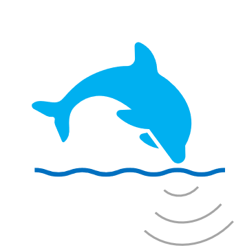

 DOLfYN
=======================

Update from Version 0.12 to 1.0+
-------------------------------

Hello everyone! This is a MAJOR REFACTOR of the code so that DOLfYN is
now built on xarray, rather than the somewhat contrived and
purpose-built `pyDictH5` package.

This means that DOLfYN 1.0 is _not_ backwards compatible with
earlier version. This, in turn, means two things:

1. The data files (`.h5` files) you created with earlier versions
of DOLfYN will no longer load with DOLfYN > v1.0.0.
2. The syntax of DOLfYN 1.0 is completely different from earlier version.

Because of this, it's probably easiest to continue using earlier
versions of DOLfYN for your old data. If you want to bring some data
into DOLfYN 1.0, you will need to
`dolfyn.read(binary_source_file.ext)`, and then refactor your code to
work properly with DOLfYN's new syntax. I may be providing some
updates to dolfyn 0.12 via the v0.12-backports branch (and associated
releases), but I doubt that will last long. If you are
using 0.13, we recommend switching to 1.0.

Summary
------

DOLfYN is the Doppler Oceanography Library for pYthoN.

It is designed to read and work with Acoustic Doppler Velocimeter
(ADV) and Acoustic Doppler Profiler (ADP/ADCP) data. DOLfYN includes
libraries for reading binary Nortek(tm) and Teledyne RDI(tm) data
files.
* Read in binary data files from acoustic Doppler instruments
* Clean data
* Rotate vector data through coordinate systems (i.e. beam - instrument - Earth frames of reference)
* Motion correction for buoy-mounted ADV velocity measurements (via onboard IMU data)
* Bin/ensemble averaging
* Calculate turbulence statistics

Documentation
-------------

For details visit the 
[DOLfYN homepage](https://dolfyn.readthedocs.io/en/latest/).  

Installation
------------

DOLfYN requires Python 3.7 or later and a number of dependencies. See the 
[install page](https://dolfyn.readthedocs.io/en/latest/install.html)
for greater details.

License
-------

DOLfYN is copyright through the National Renewable Energy Laboratory, 
Pacific Northwest National Laboratory, and Sandia National Laboratories. 
The software is distributed under the Revised BSD License.
See the [license](LICENSE.txt) for more information.

