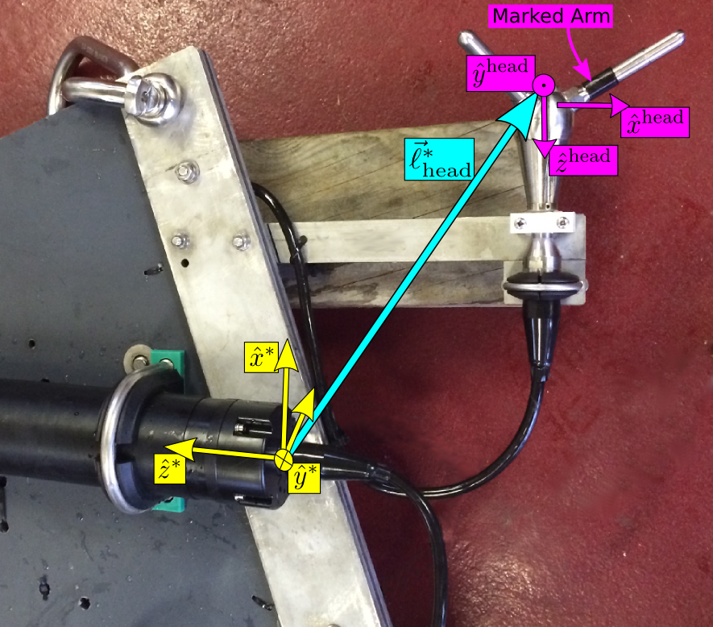

.. _usage-specific:

.. |pm|   unicode:: U+00B1 .. PLUS-MINUS SIGN

Usage - Specific Cases
======================

Motion Correcting IMU-ADV measurements
--------------------------------------

The Nortek Vector ADV can be purchased with an Inertial Motion Unit
(IMU) that measures the ADV motion. These measurements can be used to
remove motion from ADV velocity measurements when the ADV is mounted
on a moving platform (e.g. a mooring). This approach has been found to
be effective for removing high-frequency motion from ADV measurements,
but cannot remove low-frequency (:math:`\lesssim` 0.03Hz) motion
because of bias-drift inherent in IMU accelerometer sensors that
contaminates motion estimates at those frequencies.

This documentation is designed to document the methods for performing
motion correction of IMU-ADV measurements. The accuracy and
applicability of these measurements is beyond the scope of this
documentation (journal articles are forthcoming).

Pre-Deployment Requirements
...........................

In order to perform motion correction the IMU-ADV must be assembled
and configured correctly:

1. The ADV *head* must be rigidly connected to the ADV *body*
   (pressure case, which contains the IMU sensor).

   a. For fixed-head (fixed-stem) ADVs the body is rigidly connected
      to the body.

   b. For cable-head (cabled-probe) ADVs, a support structure must be
      constructed that rigidly connects the ADV body to the head.

2. The ADV software must be configured properly.  In the 'Deployment
   Planning' frame of the Vector Nortek Software, be sure that:

   a. The IMU sensor is enabled (checkbox) and set to record *'Accl AngR Mag
      xF'*.

   b. The 'Coordinate system' must be set to *'XYZ'*.

   c. It is recommended to set the ADV velocity range to |pm| *4 m/s*,
      or larger.

3. For cable-head ADVs be sure to record the position and orientation
   of the ADV head relative to the ADV body (Figure 1).

   Figure 1) Coordinate systems of the ADV body (magenta) and head
   (yellow). The :math:`\hat{x}^\mathrm{head}` -direction is known by
   the black-band around the transducer arm, and the
   :math:`\hat{x}^*` -direction is marked by a notch on the end-cap
   (indiscernible in the image). The cyan arrow indicates the
   body-to-head vector, :math:`\vec{\ell}_{head}^*` .  The perspective
   slightly distorts the fact that :math:`\hat{x}^\mathrm{head}
   \parallel - \hat{z}^*` , :math:`\hat{y}^\mathrm{head} \parallel
   -\hat{y}^*` , and :math:`\hat{z}^\mathrm{head} \parallel
   -\hat{x}^*` .

Data processing
...............

After making IMU-ADV measurements, the |dlfn| package can perform
motion correction processing steps on the ADV data. There are two
primary methods for going about this:

1. Utilize the |dlfn| api perform motion-correction processing
   explicitly in Python::

     from dolfyn.adv import api as adv
     import numpy as np

   Load your data file, for example::

     dat_raw = adv.read_nortek('vector_data_imu01.vec')

   Then specify the position and orientation of the ADV head relative
   to the body. These must be specified as entries in the ``props``
   attribute.  For a 'fixed-head' Nortek Vector ADVs, the rotation
   matrix is the identity matrix and the position is::

     dat_raw.props['body2head_vec'] = np.array([0., 0., -0.21])  # in meters

     dat_raw.props['body2head_rotmat'] = np.eye(3)

   For a cable-head ADV, you must specify the position and orientation
   for your configuration. For example, the position and orientation
   of the ADV-head in Figure 1 is::
   
     dat_raw.props['body2head_vec'] = np.array([0.48, -0.07, -0.27])  # in meters

     dat_raw.props['body2head_rotmat'] = np.array([[0, 0, -1],
                                                   [0, -1, 0],
                                                   [-1, 0, 0],])

   Now we create a 'motion correction' instance, a tool that performs
   motion correction. This tool can be initialized with the high-pass
   filter frequency you wish to use to remove low-frequency bias drift
   from the IMU accelerometer signal (the default value is 0.033Hz,
   30second period)::

     mc = adv.motion.CorrectMotion(accel_filtfreq=0.1) # specify the filter frequency in Hz.

   Now you can use this motion correction *tool* to perform motion
   correction of your data object::

     mc(dat_raw)

   Your ``dat_raw`` object is now motion corrected and it's ``.u``,
   ``.v`` and ``.w`` attributes are in an East, North and Up (ENU)
   coordinate system, respectively.  In fact, all vector quantities
   in ``dat_raw`` are now in this ENU coordinate system.

2. For users who want to perform motion correction with minimal Python
   scripting, the **motcorrect_vector.py** script can be used. So long as
   |dlfn| has been `installed properly <install>`_, you can use this
   script from the command line in a directory which contains your
   data files.  By default it will write a Matlab file containing your
   motion-corrected ADV data in ENU coordinates.

   a. For fixed-head ADVs, the position and orientation of the head
      are known to the script so that all that is necessary is to
      call, for example\ [#prfxnote]_::

        $ python motcorrect_vector.py --fixed-head vector_data_imu01.vec

   b. For cable-head ADVs, you must specify the position and
      orientation of the head in a *.orient* file (the extension is
      not required).  These files are simply python scripts which
      define ``ROTMAT`` and ``VEC`` variables, for the head position
      and orientation in Figure 1 the 'My_Vector.orient' file could be
      as simple as::

        VEC = [0.48, -0.07, -0.27]  # in meters

        ROTMAT = [[0, 0, -1],
                  [0, -1, 0],
                  [-1, 0, 0],]

      Examples of estimating ROTMAT for more complex orientations can
      be found in the *.orient* files found in the :repo:`examples directory </tree/master/examples/>` of the :repo:`dolfyn repository </>`.

      It is also possible to specify a magnetic declination in the
      *.orient* file. Magnetic declination (the direction of Magnetic
      North) is specified in degrees clockwise from True North. For
      example::

        DECLINATION = 16.3

      By specifying the declination in this way, the data output by
      the motcorrect_vector.py script will be in an ENU coordinate
      system refeferenced to True North, rather than magnetic north
      (when the declination is not specified).  Values for declination
      can be obtained from a number of websites, e.g. `<http://www.ngdc.noaa.gov/geomag-web/>`_.

      With the orientation file defined, you specify it on the command
      line using the ``-O`` flag\ [#prfxnote]_::
        
        $ python motcorrect_vector.py -O My_Vector.orient vector_data_imu01.vec

   The motcorrect_vector.py script also allows the user to specify the
   ``accel_filtfreq`` using the ``-f`` flag.  Therefore, to use a
   filter frequency of 0.1Hz (as opposed to the default 0.033Hz), you
   could do\ [#prfxnote]_::
     
     $ python motcorrect_vector.py -O My_Vector.orient -f 0.1 vector_data_imu01.vec

   It is also possible to do motion correction of multiple data files
   at once, for example\ [#prfxnote]_::

     $ python motcorrect_vector.py --fixed-head vector_data_imu01.vec vector_data_imu02.vec

   In all of these cases the script will perform motion correction on
   the specified file and save the data in ENU coordinates, in Matlab
   format.  Happy motion-correcting!

.. [#prfxnote] Calling ``python`` explicitly in the command line is
               probably only required on Windows platforms.
